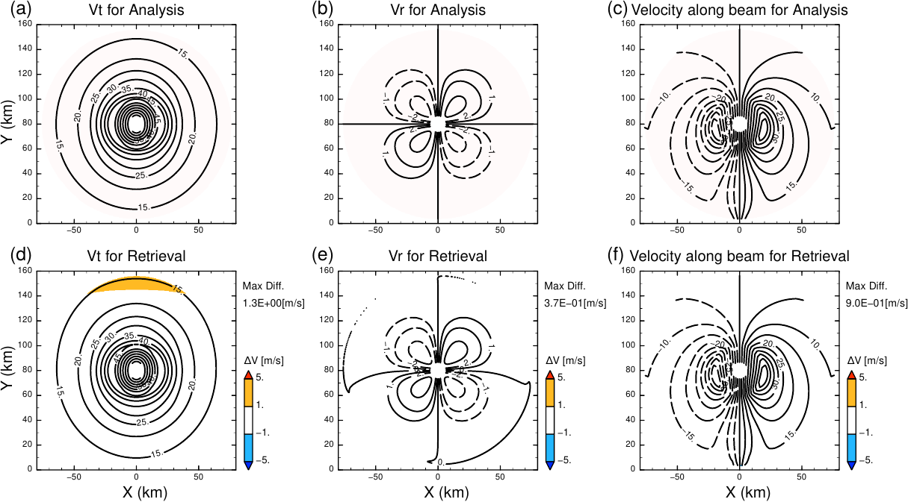

# Introduction of GVTD-X
GVTD-X is a numerical method to retrieve tangential and radial wind components in atmospheric vortices from single-Doppler radar observations, which is named from pronounciation of a abbreviation "GVTD-HeCs" (Generalized Velocity Track Display with the Helmholtz-decomposition-based Closure assumption). The method is coded by Fortran. You can use it by linking the static library `libGVTDX.a`. 

# Features (Updates from previous methods)
* Introducing asymmetric radial wind components in the closure assumption
  * Accurate wind retrievals for atmospheric vortices with asymmetric tangential and radial wind components
  * Insensitive of the retrieved axisymmetric winds to errors of the vortex-center estimation, compared with GBVTD and GVTD
* Simultaneously solving the retrieval equations for entire radii
  * Radial consistency of the asymmetric winds even in potential radial gaps due to insufficient sampling in the azimuth

# Methods
Paper (submitted, [preprint](https://jxiv.jst.go.jp/index.php/jxiv/preprint/view/299))

[Method descriptions](https://tomonori-93.github.io/GVTD-X/ford-doc/index.html)

[日本語による手法の定式化とその導出: Formulation and derivation (Japanese document)](https://github.com/tomonori-93/GVTD-X/blob/document/tex/document.pdf)

# Images

# USAGE
### [Install](install.md)
### [How to use](tools/README.md)
### [Demo](demo/sample.md)

# Future works
* Validation with dual-Doppler analysis
* Development of objective methods to find the vortex center
* Application to various vortices and cases
* Dynamical analyses by using this method
