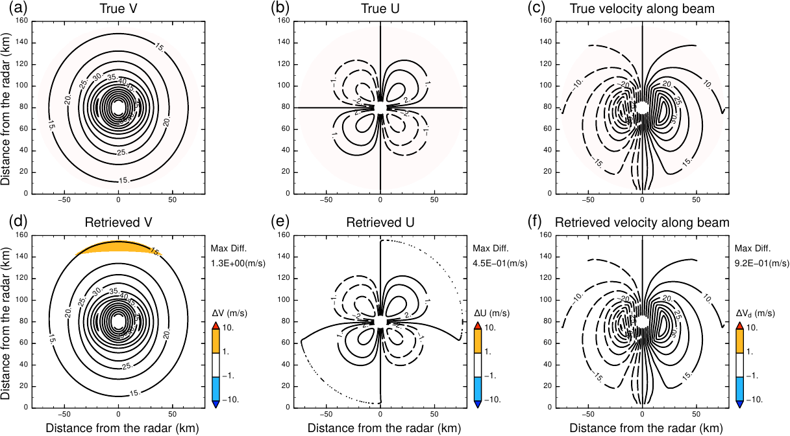

# GVTD-X
GVTD-X is a numerical method to retrieve tangential and radial wind components in atmospheric vortices from single-Doppler radar observations, which is named from pronounciation of a abbreviation "GVTD-HeCs" (Generalized Velocity Track Display with the Helmholtz-decomposition-based Closure assumption). The method is coded by Fortran. You can use it by linking the static library `libGVTDX.a`. 


# Methods
[Paper](https://doi.org/)

[Method descriptions](https://tomonori-93.github.io/GVTD-X/ford-doc/index.html)

[Formulation and derivation (Japanese document)](doc/formulation.pdf)

# Images



# Installation
You can use the `configure` script with libtool: 
```
$ export FC=gfortran
$ export FCFLAGS="-ffree-line-length-none"
$ ./configure --prefix=XXX --includedir=XXX/include  # XXX is the destination of the install
$ make
$ make install
```

### Tips
* You can use options for OpenMP in `FCFLAGS` to perform multi-threaded parallel processing (e.g., gfortran: `-fopenmp`, ifort: `-qopenmp`). 


# USAGE
You can use the subroutines and functions by linking the build library (`libGVTDX.a`) to your Fortran main programs (ex., `main.f90`) as follows: 
```
$ gfortran -IXXX/include main.f90 -LXXX -lGVTDX -o main  # -> The executable file of `main` will be built
```
* You can find [an example program](tools/GVTDX_Dradar.md) (`GVTDX_Dradar.f90`) in `tools/`


# Demo
You can perform a test program `test_Rankine_ax.f90` to check the retrieval accuracy three techniques (i.e., GVTD-X/GVTD/GBVTD) for an analytical Rankine vortex. 
```
$ cd demo/
$ make  # -> build "test_Rankine_ax"
$ ./test_Rankine_ax < test_Rankine_ax.nml
... (running) ...
*** MESSAGE(main) *** : Pass the test  # -> If this message is displayed, the libGVTDX.a passed the test
```

If DCL ([Debian](http://www.gfd-dennou.org/arch/cc-env/debian-dennou/index.htm.en)/[Ubuntu](http://www.gfd-dennou.org/arch/cc-env/ubuntu-dennou/index.htm.en)/[Source](https://www.gfd-dennou.org/arch/dcl/)) is installed in your machine, you can use [sample programs](demo/sample.md), which were used to make the figures in the [paper](https://doi.org/), in `demo/`.
```
$ make -f Makefile.dcl  # -> build test_Rankine[1-6]_dcl
$ ./test_Rankine[1-6]_dcl < test_Rankine[1-6]_dcl.nml
```
